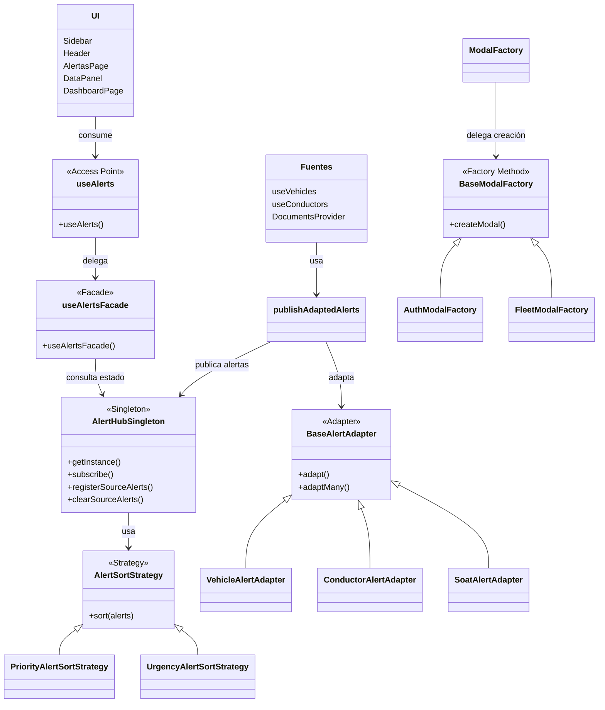

### Modelo de dominio general  
Diagrama del modelo de dominio donde se ubiquen los patrones

Este modelo de dominio general resume cómo se relacionan los principales elementos del sistema y en qué parte se ubican los patrones GoF implementados. La intención del diagrama no es mostrar cada archivo o componente del proyecto con máximo detalle, sino representar de forma clara la organización general del dominio y cómo se conectan la interfaz, el subsistema de alertas, las fuentes de datos y la creación de modales.

En la parte superior del modelo se ubica la **UI**, que agrupa componentes como `Sidebar`, `Header`, `AlertasPage`, `DataPanel` y `DashboardPage`. Todos estos elementos consumen la información del sistema de alertas por medio de `useAlerts`, que funciona como punto de entrada común. A partir de ahí, `useAlerts` delega en `useAlertsFacade`, lo que permite representar el patrón **Facade**, ya que la interfaz no depende directamente de toda la complejidad interna del sistema, sino de una entrada más simple y organizada.

Luego aparece `AlertHubSingleton`, que concentra el estado del sistema de alertas. Este elemento representa el patrón **Singleton**, porque asegura que exista una sola instancia compartida del hub para todo el sistema. La fachada consulta el estado centralizado del hub, y las distintas fuentes publican sus alertas en ese mismo punto común.

El patrón **Strategy** se ubica en la relación entre `AlertHubSingleton` y `AlertSortStrategy`. El hub usa una estrategia activa de ordenamiento para las alertas, mientras que `PriorityAlertSortStrategy` y `UrgencyAlertSortStrategy` representan implementaciones concretas que pueden intercambiarse sin cambiar la estructura principal del sistema.

En el bloque de adaptación de datos se observa `BaseAlertAdapter`, junto con `VehicleAlertAdapter`, `ConductorAlertAdapter` y `SoatAlertAdapter`. Aquí se representa el patrón **Adapter**, porque las distintas fuentes del sistema generan datos con estructuras diferentes, y los adapters los convierten a un formato común de alertas. La clase `publishAdaptedAlerts` actúa como punto común que usa esa interfaz de adaptación y publica el resultado en el hub.

La clase agrupada como `Fuentes` representa de manera simplificada a `useVehicles`, `useConductors` y `DocumentsProvider`. Estas fuentes generan información que luego es adaptada y publicada al hub centralizado. Por esa relación de publicación y actualización del estado también se evidencia el patrón **Observer**, ya que las fuentes producen cambios y el hub actúa como centro de notificación del sistema.

Finalmente, en la parte inferior derecha del modelo aparece la creación de modales. Allí se observa `BaseModalFactory`, junto con `AuthModalFactory`, `FleetModalFactory` y `ModalFactory`. Este bloque representa el patrón **Factory Method**, porque la creación de modales se delega a fábricas concretas en lugar de concentrarse en una sola estructura rígida. `ModalFactory` no crea directamente todos los modales, sino que delega esa responsabilidad en la fábrica correspondiente.

En conjunto, este diagrama muestra que el dominio del proyecto está organizado alrededor de dos grandes áreas: el subsistema de alertas y la creación de modales. Dentro de esas áreas se ubican de manera integrada los patrones **Facade**, **Singleton**, **Strategy**, **Adapter**, **Observer** y **Factory Method**, lo que permite entender cómo la solución combina varios patrones para mejorar la organización, la extensibilidad y la mantenibilidad del sistema.

**Observación breve del modelo de dominio:**  
El modelo de dominio se concentra en dos partes principales: el subsistema de alertas y la creación de modales. En alertas, la interfaz entra por `useAlerts`, que delega en la fachada `useAlertsFacade`, mientras el estado centralizado se mantiene en `AlertHubSingleton`. Las fuentes de datos publican alertas adaptadas a un formato común y el hub aplica una estrategia de ordenamiento. En la creación de modales, `ModalFactory` delega la construcción en fábricas concretas. Así se evidencian de forma integrada los patrones `Facade`, `Singleton`, `Strategy`, `Adapter`, `Observer` y `Factory Method`.
