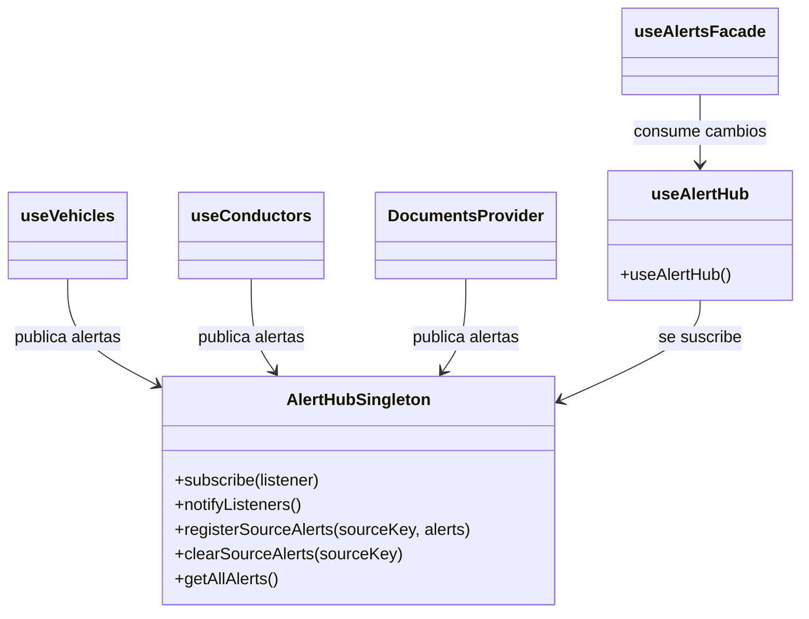

# Patrón Observer — Hub central de alertas

## Diagrama

## Tipo
Comportamental

## Propósito
Propagar automáticamente los cambios de alertas desde las fuentes del sistema hacia los consumidores, sin acoplar directamente la interfaz a cada fuente individual.

## Problema que resuelve
Vehículos, conductores y documentos generan cambios en el estado de alertas. Si cada componente consumidor tuviera que consultar manualmente cada fuente, el sistema sería más acoplado, difícil de mantener y menos escalable.

## Solución implementada
Se implementó un sujeto observable en `AlertHubSingleton.js`, que:
- registra observadores,
- recibe actualizaciones desde distintas fuentes,
- consolida las alertas,
- y notifica cambios a los consumidores suscritos.

El hook `useAlertHub()` permite que otros módulos se suscriban al hub, mientras que las fuentes publican alertas usando `registerSourceAlerts(...)`.

## Participantes
- **Subject:** `AlertHubSingleton.js`
- **Suscripción al subject:** `useAlertHub.js`
- **Publicadores:** `useVehicles.js`, `useConductors.js`, `DocumentsContext.jsx`
- **Consumidor intermedio:** `useAlertsFacade.js`

## Evidencia en código
- `apps/web/src/patterns/singleton/AlertHubSingleton.js`
- `apps/web/src/hooks/useAlertHub.js`
- `apps/web/src/hooks/useVehicles.js`
- `apps/web/src/hooks/useConductors.js`
- `apps/web/src/contexts/DocumentsContext.jsx`
- `apps/web/src/hooks/useAlertsFacade.js`

## Explicación y justificación del diagrama
En el diagrama, `AlertHubSingleton` aparece como el sujeto observable, ya que centraliza la colección de listeners y las operaciones de suscripción, notificación, registro y limpieza de alertas. Esta estructura permite que múltiples publicadores interactúen con un único centro de eventos sin conocer directamente a los consumidores.

`useVehicles`, `useConductors` y `DocumentsProvider` aparecen como publicadores del sistema. Cada uno genera alertas a partir de su propia fuente y las envía al hub mediante una operación común. Por otro lado, `useAlertHub` se suscribe a ese sujeto observable y expone el estado actualizado a otros módulos, como `useAlertsFacade`.

La justificación del patrón se basa en la necesidad de desacoplar a las fuentes de alertas respecto de la interfaz y de otros consumidores. El patrón `Observer` permite que los cambios se propaguen automáticamente sin requerir dependencias directas entre cada productor y cada cliente. Esto mejora la cohesión del sistema y facilita su evolución.

## Conclusión
El patrón `Observer` se justifica porque el sistema necesita reaccionar a cambios en múltiples fuentes de alertas de forma automática y desacoplada. El hub central permite esa propagación de eventos y mantiene coherencia entre publicación y consumo.