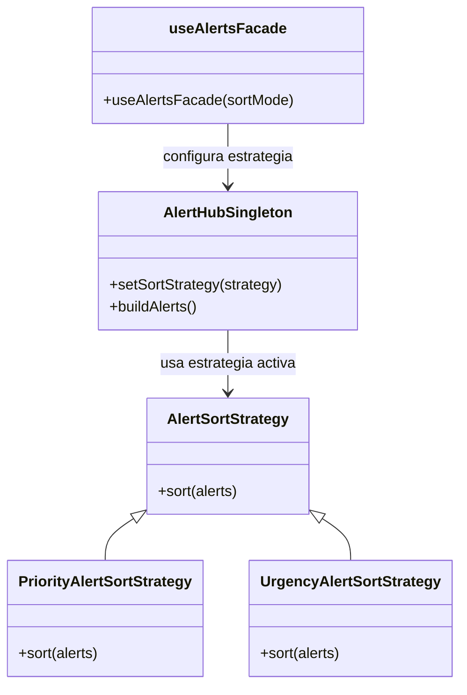

# Patrón Strategy — Ordenamiento de alertas

## Diagrama

## Tipo
Comportamental

## Propósito
Permitir el cambio del algoritmo de ordenamiento de alertas sin modificar la estructura central del sistema.

## Problema que resuelve
El sistema necesita ordenar alertas según distintos criterios. Si ese algoritmo estuviera incrustado directamente en el hub o en la fachada, cualquier cambio en el criterio de orden obligaría a modificar el contexto y aumentaría el acoplamiento con una única lógica fija.

## Solución implementada
Se definió una estrategia base:
- `AlertSortStrategy.js`

Y se implementaron dos estrategias concretas:
- `PriorityAlertSortStrategy.js`
- `UrgencyAlertSortStrategy.js`

El contexto que utiliza la estrategia es:
- `AlertHubSingleton.js`

La selección de la estrategia se realiza desde:
- `useAlertsFacade.js`

## Participantes
- **Strategy:** `AlertSortStrategy.js`
- **ConcreteStrategies:** `PriorityAlertSortStrategy.js`, `UrgencyAlertSortStrategy.js`
- **Context:** `AlertHubSingleton.js`
- **Selector de estrategia:** `useAlertsFacade.js`

## Evidencia en código
- `apps/web/src/patterns/strategy/AlertSortStrategy.js`
- `apps/web/src/patterns/strategy/PriorityAlertSortStrategy.js`
- `apps/web/src/patterns/strategy/UrgencyAlertSortStrategy.js`
- `apps/web/src/patterns/singleton/AlertHubSingleton.js`
- `apps/web/src/hooks/useAlertsFacade.js`

## Explicación y justificación del diagrama
En el diagrama, `AlertSortStrategy` representa la abstracción común del algoritmo de ordenamiento. Las clases `PriorityAlertSortStrategy` y `UrgencyAlertSortStrategy` heredan de esta base e implementan criterios concretos diferentes para ordenar la colección de alertas.

`AlertHubSingleton` aparece como el contexto que usa una estrategia activa para construir la lista final de alertas. A su vez, `useAlertsFacade` participa como el punto que selecciona qué estrategia debe configurarse en el contexto según el modo de ordenamiento que se quiera aplicar.

La justificación del patrón se basa en que el sistema necesita poder variar el algoritmo sin cambiar la estructura central del hub. El patrón `Strategy` permite encapsular distintos algoritmos bajo una misma interfaz, reducir el acoplamiento y hacer más flexible la lógica de ordenamiento.

## Conclusión
El patrón `Strategy` se justifica porque el sistema de alertas necesita soportar diferentes criterios de ordenamiento sin modificar el contexto principal. La estrategia activa se puede intercambiar, manteniendo el diseño más extensible y desacoplado.