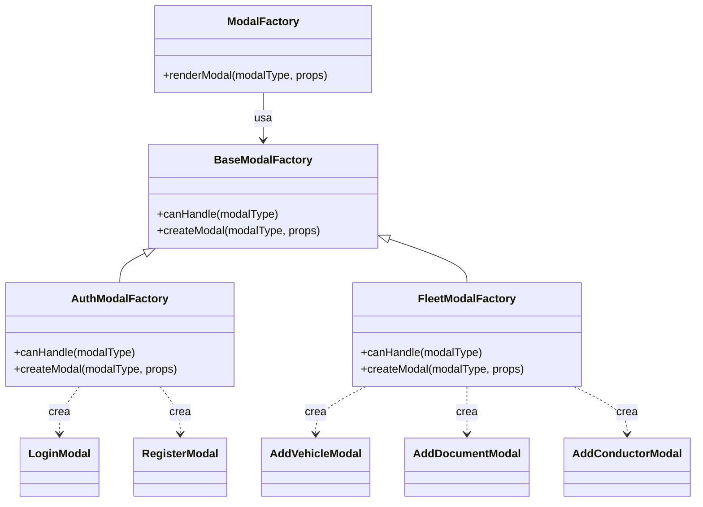

# Patrón Factory Method — Creación de modales del sistema

## Diagrama

## Tipo
Creacional

## Propósito
Delegar la creación de modales a fábricas concretas, evitando concentrar toda la lógica de instanciación en un solo bloque condicional y permitiendo organizar la creación por familias de modales.

## Problema que resuelve
El sistema necesita crear distintos modales según el flujo funcional, por ejemplo modales de autenticación y modales de flota. Si toda esa lógica se concentra en un único componente con múltiples condiciones, el diseño se vuelve más rígido, difícil de mantener y menos extensible.

## Solución implementada
Se definió una jerarquía de creadores:
- `BaseModalFactory`
- `AuthModalFactory`
- `FleetModalFactory`

Cada fábrica concreta redefine el método `createModal(...)` para construir los modales que le corresponden. El cliente `ModalFactory` selecciona la fábrica adecuada y delega en ella la creación del modal solicitado.

## Participantes
- **Creator:** `BaseModalFactory.jsx`
- **ConcreteCreators:** `AuthModalFactory.jsx`, `FleetModalFactory.jsx`
- **Cliente:** `ModalFactory.jsx`

## Evidencia en código
- `apps/web/src/patterns/factory/BaseModalFactory.jsx`
- `apps/web/src/patterns/factory/AuthModalFactory.jsx`
- `apps/web/src/patterns/factory/FleetModalFactory.jsx`
- `apps/web/src/components/ModalFactory.jsx`

## Explicación y justificación del diagrama
En el diagrama, `BaseModalFactory` representa el creador base que define el contrato de creación mediante `createModal(...)`. Este contrato es heredado por `AuthModalFactory` y `FleetModalFactory`, que funcionan como creadores concretos y encapsulan la lógica de construcción de modales según su dominio funcional.

`ModalFactory` aparece como el cliente que decide qué fábrica concreta usar y delega en ella la creación del modal. De esta forma, la responsabilidad de instanciación no queda concentrada en un único punto con lógica rígida, sino distribuida en una jerarquía de creadores.

La justificación del patrón se basa en que el sistema necesita crear objetos relacionados —modales de distintos grupos funcionales— de forma organizada y extensible. Si en el futuro se agregan nuevas familias de modales, el diseño permite incorporar nuevas fábricas concretas sin modificar por completo la estructura existente. Esto mejora la mantenibilidad y hace más clara la responsabilidad de creación.

## Conclusión
El patrón `Factory Method` se justifica porque la creación de modales se delega a fábricas concretas que redefinen el método de construcción. Esto ordena la lógica de instanciación, facilita la extensión del sistema y evita concentrar toda la creación en un único componente rígido.
