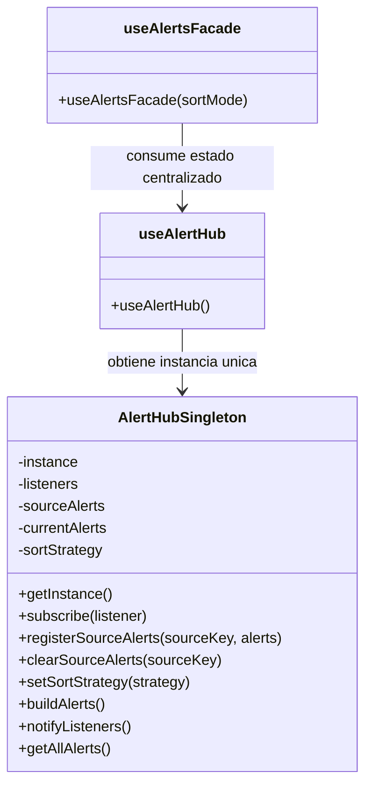

# Patrón Singleton — AlertHub del sistema de alertas

## Diagrama

## Tipo
Creacional

## Propósito
Garantizar que el sistema de alertas opere sobre una única instancia compartida del hub, de forma que la publicación, suscripción y lectura del estado centralizado sean consistentes en toda la aplicación.

## Problema que resuelve
El módulo de alertas necesita un punto único de coordinación. Si cada hook o componente creara su propia instancia del hub, las alertas quedarían fragmentadas, las suscripciones no serían consistentes y el flujo de notificación perdería coherencia.

## Solución implementada
Se implementó una clase `AlertHubSingleton` que centraliza:
- la instancia única del hub,
- la colección de listeners,
- las alertas publicadas por cada fuente,
- y la estrategia de ordenamiento activa.

El acceso a esa instancia se realiza mediante `getInstance()`, y el hook `useAlertHub()` reutiliza esa única referencia para exponer el estado al resto del sistema.

## Participantes
- **Singleton:** `AlertHubSingleton.js`
- **Cliente principal:** `useAlertHub.js`
- **Consumidor indirecto:** `useAlertsFacade.js`

## Evidencia en código
- `apps/web/src/patterns/singleton/AlertHubSingleton.js`
- `apps/web/src/hooks/useAlertHub.js`
- `apps/web/src/hooks/useAlertsFacade.js`

## Explicación y justificación del diagrama
En el diagrama, `AlertHubSingleton` representa la clase central que concentra la lógica de coordinación del sistema de alertas. La presencia del atributo `instance` y del método `getInstance()` evidencia que la creación del objeto está controlada para asegurar una única instancia compartida.

Por su parte, `useAlertHub` aparece como cliente directo del singleton, ya que reutiliza esa instancia para exponer el estado del hub y permitir que otros módulos se suscriban o publiquen alertas sin crear hubs paralelos. A su vez, `useAlertsFacade` consume `useAlertHub` como parte del flujo del sistema de alertas.

La justificación del patrón se basa en que el sistema necesita una sola fuente de verdad para las alertas. Si el hub no fuera único, habría múltiples estados inconexos, lo que rompería la propagación de cambios y haría inconsistente la visualización en la interfaz. Con este diseño, la coordinación de alertas queda centralizada, mantenible y coherente con el comportamiento real del sistema.

## Conclusión
El patrón `Singleton` se justifica porque el hub de alertas debe existir como una única instancia compartida. Esto garantiza consistencia, reduce duplicación de estado y permite que todo el sistema opere sobre el mismo centro de eventos y notificaciones.