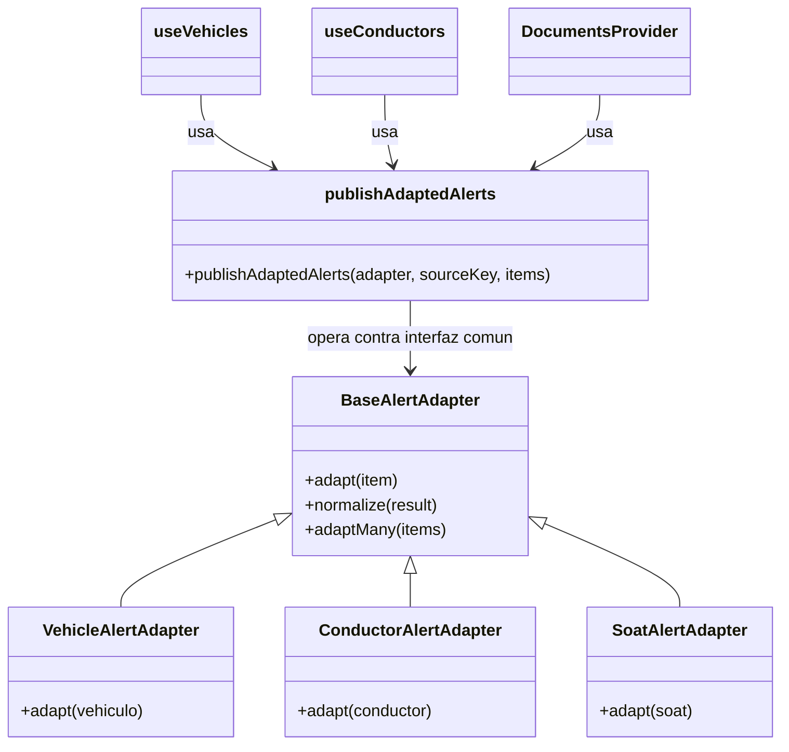

# Patrón Adapter — Normalización de fuentes de alertas

## Diagrama

## Tipo
Estructural

## Propósito
Unificar el formato de alertas provenientes de distintas fuentes del sistema, de manera que todas puedan ser publicadas y consumidas con la misma estructura.

## Problema que resuelve
Vehículos, conductores y soats tienen estructuras de datos diferentes y cada uno requiere reglas particulares para convertirse en alertas. Si cada fuente construyera su propio formato sin una adaptación común, el sistema tendría lógica duplicada, menos coherencia y mayor dificultad para mantener o extender el flujo de alertas.

## Solución implementada
Se definió una interfaz común de adaptación:
- `BaseAlertAdapter.js`

Y se implementaron adaptadores concretos:
- `VehicleAlertAdapter.js`
- `ConductorAlertAdapter.js`
- `SoatAlertAdapter.js`

Además, se creó un cliente común:
- `publishAdaptedAlerts.js`

Ese cliente trabaja contra la interfaz común del adapter, adapta los datos de la fuente correspondiente y publica el resultado unificado al hub.

## Participantes
- **Target:** `BaseAlertAdapter.js`
- **Adapters concretos:** `VehicleAlertAdapter.js`, `ConductorAlertAdapter.js`, `SoatAlertAdapter.js`
- **Cliente común:** `publishAdaptedAlerts.js`
- **Fuentes integradas:** `useVehicles.js`, `useConductors.js`, `DocumentsContext.jsx`

## Evidencia en código
- `apps/web/src/patterns/adapters/BaseAlertAdapter.js`
- `apps/web/src/patterns/adapters/VehicleAlertAdapter.js`
- `apps/web/src/patterns/adapters/ConductorAlertAdapter.js`
- `apps/web/src/patterns/adapters/SoatAlertAdapter.js`
- `apps/web/src/patterns/adapters/publishAdaptedAlerts.js`
- `apps/web/src/hooks/useVehicles.js`
- `apps/web/src/hooks/useConductors.js`
- `apps/web/src/contexts/DocumentsContext.jsx`

## Explicación y justificación del diagrama
En el diagrama, `BaseAlertAdapter` representa la interfaz común que define el contrato de adaptación. Los adapters concretos (`VehicleAlertAdapter`, `ConductorAlertAdapter` y `SoatAlertAdapter`) heredan de esa base e implementan la transformación necesaria para sus respectivas fuentes.

`publishAdaptedAlerts` aparece como el cliente común que no depende de un adapter específico, sino de la interfaz compartida. Esto es importante porque demuestra que el sistema ya no trabaja con transformaciones aisladas o duplicadas, sino con una estructura unificada de adaptación.

La justificación del patrón se basa en que las fuentes del sistema no comparten el mismo formato de datos, pero todas deben terminar en un modelo estándar de alerta. El uso de adapters permite encapsular la conversión de cada fuente sin alterar el resto del sistema. Así, el flujo de publicación al hub se mantiene uniforme y desacoplado del detalle particular de cada origen de datos.

## Conclusión
El patrón `Adapter` se justifica porque el sistema necesita convertir estructuras heterogéneas de vehículos, conductores y soats a un modelo único de alertas. Con una interfaz común y adapters concretos, se logra un diseño más coherente, extensible y fácil de mantener.