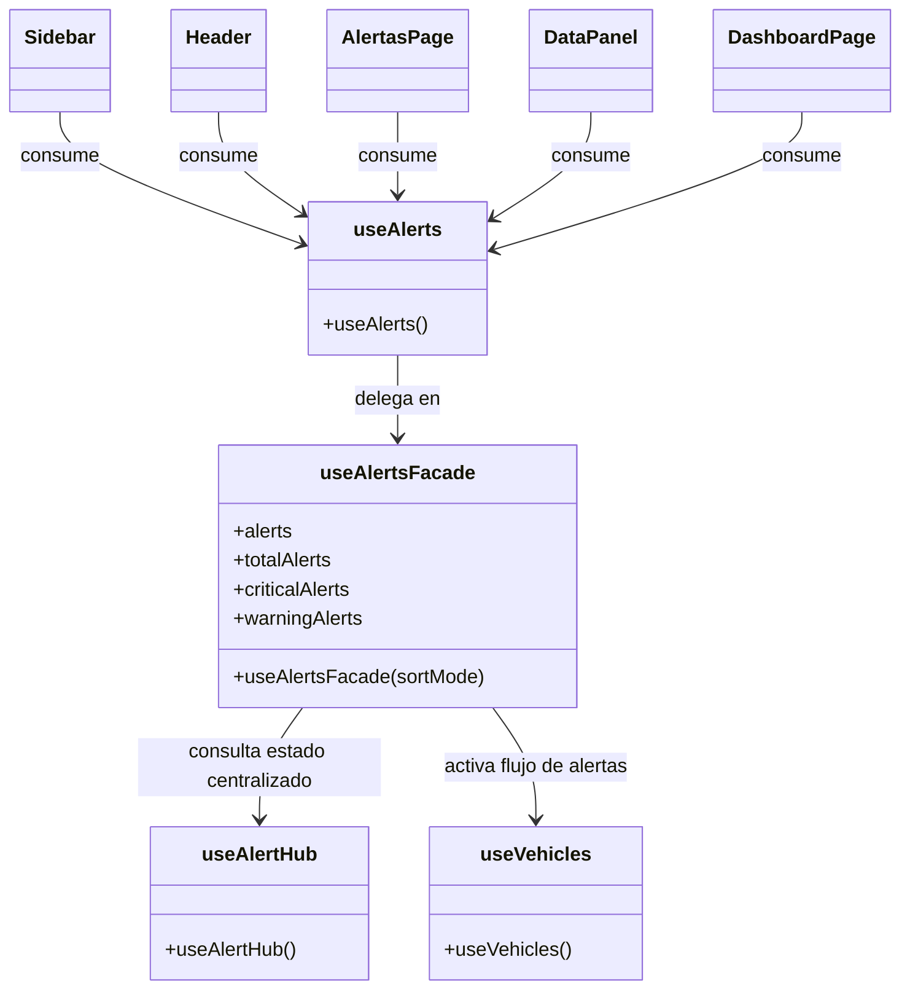

# Patrón Facade — Sistema de alertas

## Diagrama

## Tipo
Estructural

## Propósito
Centralizar el acceso al sistema de alertas mediante una interfaz simple para la UI, ocultando la coordinación interna entre el hub, las fuentes de alertas y el flujo de ordenamiento.

## Problema que resuelve
El sistema de alertas tiene una lógica interna que involucra varias piezas: publicación de alertas, suscripción al hub, activación del flujo de fuentes y cálculo de métricas para la interfaz. Si cada componente de la UI dependiera directamente de esos detalles, el diseño sería más acoplado, difícil de mantener y menos claro para extender.

## Solución implementada
Se implementó una fachada compuesta por:
- `useAlertsFacade.js`
- `useAlerts.js`

La UI no interactúa directamente con `useAlertHub`, `AlertHubSingleton` ni con el detalle interno del sistema. En cambio, consume `useAlerts()`, que delega en `useAlertsFacade()` y entrega una API simplificada:
- `alerts`
- `totalAlerts`
- `criticalAlerts`
- `warningAlerts`

## Participantes
- **Facade:** `useAlertsFacade.js`
- **Punto de acceso a la fachada:** `useAlerts.js`
- **Subsistema interno:** `useAlertHub.js`, `AlertHubSingleton.js`
- **Flujo activado desde la fachada:** `useVehicles.js`
- **Clientes:** `Sidebar.jsx`, `Header.jsx`, `AlertasPage.jsx`, `DataPanel.jsx`, `DashboardPage.jsx`

## Evidencia en código
- `apps/web/src/hooks/useAlertsFacade.js`
- `apps/web/src/hooks/useAlerts.js`
- `apps/web/src/hooks/useAlertHub.js`
- `apps/web/src/hooks/useVehicles.js`
- `apps/web/src/components/Sidebar.jsx`
- `apps/web/src/components/Header.jsx`
- `apps/web/src/pages/AlertasPage.jsx`
- `apps/web/src/components/DataPanel.jsx`
- `apps/web/src/pages/DashboardPage.jsx`

## Explicación y justificación del diagrama
En el diagrama, `useAlertsFacade` representa la fachada del sistema. Su responsabilidad no es generar directamente todas las alertas, sino ofrecer a la interfaz un acceso simplificado al subsistema de alertas ya centralizado. Por eso aparece entre los clientes de la UI y el sistema interno.

`useAlerts` funciona como punto de entrada único para los componentes de la interfaz. De esta forma, los clientes no dependen directamente del hub ni de la mecánica interna del sistema. La fachada delega en `useAlertHub`, que expone el estado centralizado de alertas, y activa el flujo de fuentes mediante `useVehicles`, que a su vez conecta con el resto del subsistema.

La justificación del patrón se basa en que la interfaz no debería conocer la complejidad interna del sistema de alertas. La fachada reduce el acoplamiento, mejora la mantenibilidad y deja una API más estable y sencilla para la UI. Esto hace que el diseño sea más claro y defendible frente a la necesidad de ocultar la complejidad interna detrás de una única entrada.

## Conclusión
El patrón `Facade` se justifica porque el sistema de alertas expone una interfaz unificada y simple para la UI, mientras encapsula internamente la coordinación entre hooks, hub centralizado y flujo de publicación de alertas. Esto reduce acoplamiento y mejora la claridad del diseño.